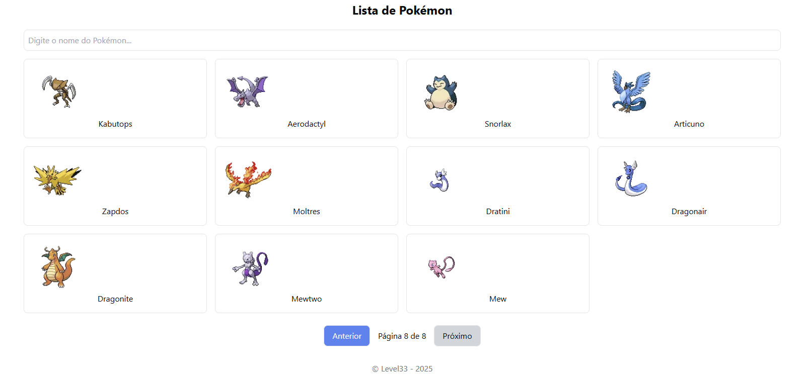

# Pokedex

Uma aplicação de busca e visualização dos 151 primeiros Pokémon usando a PokeAPI, construída com Next.js, React Query, Axios e Tailwind CSS. Permite pesquisa por nome, exibição de imagens e navegação paginada.

## Funcionalidades

- **Pesquisa por nome**: Pesquise por qualquer Pokémon da lista de 151 primeiros.
- **Exibição de imagens**: Veja as imagens dos Pokémon usando a API PokeAPI.
- **Navegação paginada**: Navegue entre os Pokémon usando botões de "Anterior" e "Próximo".
- **Responsividade**: A interface se adapta bem a diferentes tamanhos de tela, com layout moderno utilizando Tailwind CSS.

## Tecnologias Utilizadas

- [Next.js](https://nextjs.org/) - Framework para aplicações React.
- [React Query](https://react-query.tanstack.com/) - Biblioteca para gerenciamento de estado e fetch de dados.
- [Axios](https://axios-http.com/) - Cliente HTTP para fazer as requisições à API.
- [Tailwind CSS](https://tailwindcss.com/) - Framework CSS utilitário para design responsivo.
- [PokeAPI](https://pokeapi.co/) - API gratuita para obter dados sobre os Pokémon.

## Página


## Como Rodar o Projeto

### Requisitos

- [Node.js](https://nodejs.org/) - v16 ou superior.

### Instalação

1. Clone o repositório:
   ```bash
   git clone https://github.com/ElismarSilva/pokedex.git
   cd pokedex

2. Instale as dependências:
   ```bash
   pnpm install
   
3. Rode o servidor de desenvolvimento:
   ```bash
   pnpm run dev

